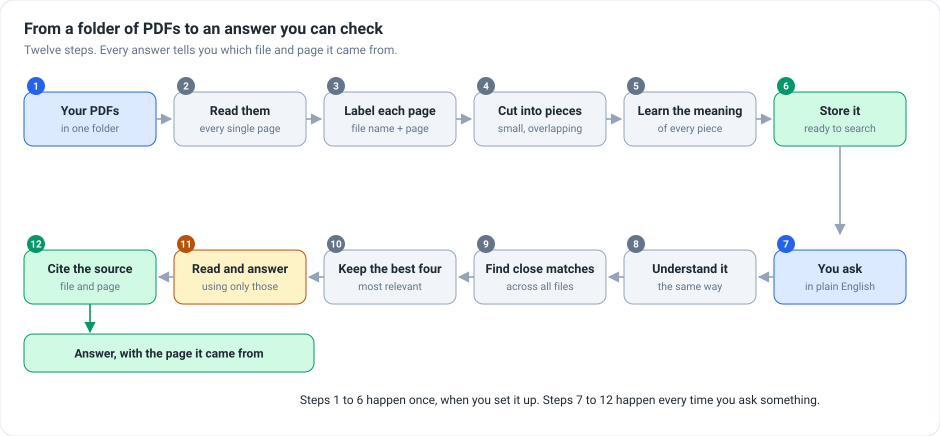
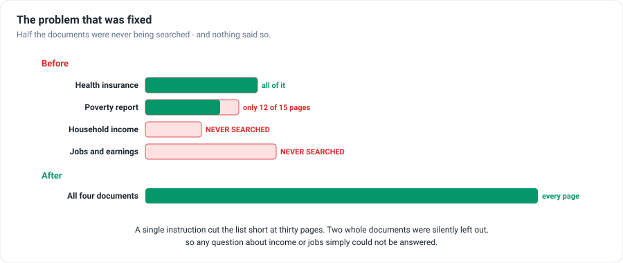
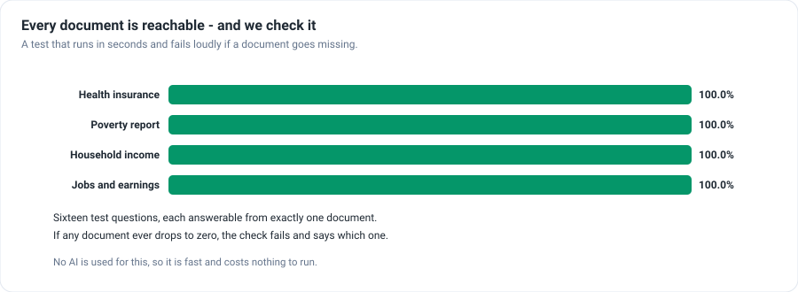

<h1 align="center">Ask Your PDFs</h1>

<p align="center">
  <b>Drop a folder of PDFs in. Ask questions about them in plain English.</b><br>
  Every answer tells you which file and which page it came from, so you can check it
  yourself.
</p>

<p align="center">
  
  
  
  
</p>

---

## What is this

Reading a long report to find one fact is slow, and searching for a word only works if you
already know which word was used. This lets you ask the question instead — *"what does it
say about household income?"* — and get the answer along with the exact page it came from.

The example set here is four US Census Bureau reports (63 pages) about health insurance,
poverty, household income, and jobs and earnings. Swap in your own folder and it works the
same way.

---

## What happens when you ask



```
Your PDFs sit in a folder
  → Read them              every single page
  → Label each page        which file, which page number
  → Cut into pieces        small and overlapping, so nothing is lost at the joins
  → Learn the meaning      of every piece
  → Store it               ready to search
  → You ask a question     in plain English
  → Understand it          the same way as the pieces
  → Find close matches     across all your documents
  → Keep the best four     the most relevant pieces
  → Read and answer        using only those pieces, nothing invented
  → Cite the source        file name and page number
→ An answer you can go and check
```

The first six steps happen once when you set it up. The rest happen every time you ask.

---

## The problem this project had

It looked like it worked. It didn't — and nothing said so.



One instruction cut the reading list short at thirty pages. Because each page counts as one
item, that meant **two of the four documents were never searched at all**, and a third was
only partly there.

Any question about household income or about jobs came back with a confident answer drawn
from whatever unrelated text happened to rank highest. There was no error, no warning, and
no way to tell.

**Now every page of every document is read.** 63 pages, 301 searchable pieces.

---

## And now it is checked automatically



There are sixteen test questions, each answerable from exactly one document. The check
reports whether each document can still be found — and **fails loudly if any of them drops
to zero**, which is exactly what would happen if the old problem ever came back.

It uses no AI, so it runs in seconds and costs nothing.

---

## Setting it up

**Step 1 — download and install**

```bash
git clone https://github.com/bharatsoni0047/GenAI-PDF-Question-Answering-Using-NVIDIA.git
cd GenAI-PDF-Question-Answering-Using-NVIDIA
pip install -r requirements.txt
```

**Step 2 — add your key**

```bash
cp .env.example .env
```

Put a key in it. A free one is available at [build.nvidia.com](https://build.nvidia.com).

```ini
NVIDIA_API_KEY=your-key-here
```

**Step 3 — read the documents** *(once)*

```bash
python ingest.py
```

You should see all four documents listed. Add your own PDFs to the `pdfs/` folder and run
this again to include them.

**Step 4 — start it**

```bash
streamlit run app.py
```

**Step 5 — ask something**

Type a question and press Enter. The answer appears with its sources underneath — the same
pieces the answer was written from, not a second, separate search.

**Step 6 — check the search quality**

```bash
python evaluate.py
```

Prints how reliably each document can be found.

---

## For developers

<details>
<summary>Technical details — click to expand</summary>

**Stack:** Python 3.11 · Streamlit · LangChain · Chroma (persisted) · NVIDIA NIM
(`nv-embed-v1` embeddings, `deepseek-v3.2` chat)

**The bug:** `PyPDFDirectoryLoader` returns one `Document` per page. The original code ran
`split_documents(docs[:30])` inside a Streamlit button handler, so on this 63-page corpus
it indexed pages 0–29 and silently dropped 52%:

| PDF | Pages | Old behaviour |
|---|---|---|
| acsbr-015.pdf | 18 | fully indexed |
| acsbr-016.pdf | 15 | 12 of 15 |
| acsbr-017.pdf | 9 | **never indexed** |
| p70-178.pdf | 21 | **never indexed** |

**Also fixed:**
- Retrieval ran twice per question — once in the chain, once again to fill the sources
  expander — so the excerpts shown were not necessarily the ones used. Now retrieves once
  and passes the documents through.
- Chunks carried no metadata, so citations were impossible. Each chunk now stores
  `source_file` and `page_number`, and the prompt requires `[file p.N]` citations.
- Indexing moved out of the UI into `ingest.py`, shared with the eval.
- Added `.gitignore` (`.env` and `chroma_db/` were previously committable), removed a
  leftover debug print and an unused FAISS import, dropped `faiss-cpu` and `openai` from
  requirements, deleted a stray demo file containing a hardcoded key placeholder.

**Layout:**

```
config.py        every setting, one place
ingest.py        PDFs -> pages -> chunks -> vector store (run once)
rag.py           retrieval + prompt + answer, shared by the UI and the eval
app.py           Streamlit interface
evaluate.py      scores retrieval, no AI calls
data/            16 eval questions with the document each should hit
pdfs/            the source documents
```

**Note:** the eval needs the API key because the query must be embedded with the same model
as the index. It makes no chat-model calls, so it stays cheap.

</details>

---

## Honest limitations

- **Search is by meaning only.** No keyword matching or re-ranking layer. Worth adding if
  the collection grows a lot — but measure it first rather than assuming it helps.
- **The check covers finding, not writing.** It proves the right document is found. Whether
  the written answer is correct is not measured automatically.
- **Scanned PDFs will not work.** Text is read directly, so image-only pages come out
  empty.

---

## The story behind this project

The problem, the decisions and what came out of them: **[STAR.md](STAR.md)**.
